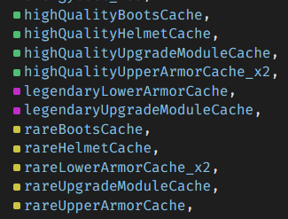

## Inventory

You can access your inventory by clicking the option at the bottom menu bar. In your inventory, you can see all items that you own, including gears, upgrade modules, ammo, medical items, secret keys, cache, and other consumables. By clicking on the item, you can see the details of that item. You can choose to equip your gear by clicking the equip button. Equipped gear will be highlighted on the top of inventory page. By clicking on gears, you can choose to install upgrade modules that will enhance certain values of that gear. To remove installed upgrade modules, simply click on the installed module. Better quality gear have more upgrade module slots than lower quality gear. 
Your cache in your inventory can be onsumed to print out gear using molecular printing function in City Centre.
Medical items can be consumed in dungeons to regenerate health (since your character cannot automatically regenerate health in dungeons).
Ammo can be used to perform special attacks and destructive attacks during combat.
Secret key fragments that you obtained in dungeon chests can be merged into a secret key by brute-force in terminal, which can be found in the City Centre. Secret keys will grant you access to higher level enemy spawns and dungeons.
Other consumables, for example Hash Processors and AI Cores can be used to perform AFK tasks.
By clicking the icon above your inventory list, you can filter out specified inventory.
You will have 50 space, equipping gears with extra pocket status will give you more inventory space.
To get rid of gears and upgrade modules, you can click on the **scrap** button. Every item scrapped will give you a tech scrap.
To get rid of other items, you can click on the **destroy** button. Destroyed items will not give you anything in return so be cautious when performing this action.
**Item Inbox**
Items that other players send will be automatically placed in your item inbox and will move to your main inventory when you have enough space for these items.
**Crafting**
This tab in your inventory allows you to craft medical items and ammo using medical tech parts and ammunition tech parts.

 

### Molecular Printing

In the City Center, there is the Molecular 3D Printer, which is going to become your best friend. It will be in the `nearby` section of the `Surrounding.ts` file when you are in Shangri La City Center. Clicking on it will open another "file view" where you will be shown what available recipes you have in your inventory. It costs bitcoin to print, so make sure you have enough. It will tell you when you hover over the recipe how much it will cost.

 

Recipes are the objects in your inventory with the word `cache` in their name. For example `commonHelmetCache_x1` is an example of a recipe to print a Common helmet, and you only have one of them.

 

In the Molecular Printer screen, you can hover over any of the recipes and click `Molecular Print` which will bring up a dialog if you have multiple items that are the same, asking how many you want to print.

 

A good strategy here is to print all the `trash` items first, then the `common`, saving `rare` and `legendary` for the end. The reason for this is printing the more common and useless items first boosts your Printing Level, giving you a better chance to print more powerful gear with any Rare and Legendary recipes you may have found.

> **Tip:** If you have a lot of bitcoin, you can just click on each recipe to bring up the quantity dialog and get it printed. This saves time on hovering.

 

Once you have printed all your recipes, you'll want to head over to your Inventory screen and see how much you can scrap and how much you can use.

 

## The WeaponSmith

The Weaponsmith is a vendor in Shangri La City Center that allows you to sell items for bitcoin, and they often have items for purchase.

 

When you are in the Weaponsmith screen, hover over anything in your inventory and choose the `Sell` option. Alternately, you will see the items available for sale at the top. You can hover over any of them and choose `Buy` if you can afford them.
