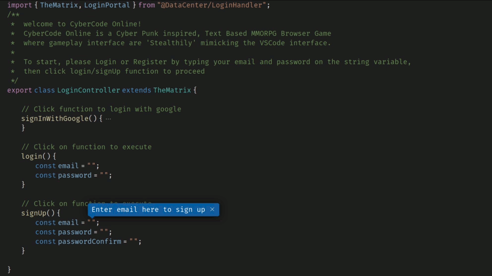

# Getting Started in CyberCode Online

CyberCode Online is laid out like the popular code editor [Visual Studio Code](https://code.visualstudio.com/). On the left-hand side you will find several icons. The top one is the most important, as that is the Explorer where you access the actual code files for the game. The game is played as if you were a developer editing a project in your code editor!

 

In the File Explorer, the left-hand column is where you will find various "files" that will open up on the right-hand side which allow you to access various parts of your character and the game. The default file is `Surrounding.ts` which describes your surroundings, wherever you are geographically in the game. It will have your location and current player status defined as variables. Below that, it will let you know if there are **Actions** you can do, if there are **Enemies** or **Allies** nearby, and where you can **Travel**.

 

Be sure to check the other tutorial pages for info discussing the features of the various files such as `surroundingTutorial.ts` which discusses the areas of Shangri La and how to travel between them.

 

## Account Creation & Login

You can login with your Google account by clicking `signInWithGoogle()` and then enter your email and password. Once logged in type a `displayName` between the quotes `""` and click `save()`.

 

Alternatively create an account using your email address by typing it between the quotes `""` in the `const email="";` section of `signUp()` area as well as a password in both `const password="";` and `const passwordConfirm="";` then click `signUp()` itself to finalize the account creation.  Once account is created type a `displayName` and click `save()`.

