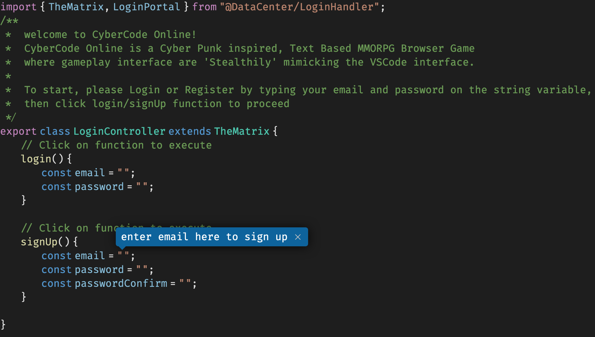
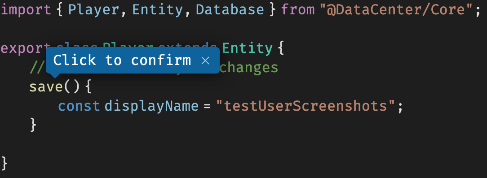

# Getting Started in CyberCodeOnline

CyberCodeOnline is laid out like the popular code editor [Visual Studio Code](https://code.visualstudio.com/). On the left-hand side you will find several icons. The top one is the most important, as that is the Explorer where you access the actual code files for the game. The game is played as if you were a developer editing a project in your code editor!

In the File Explorer, the left-hand column is where you will find various "files" that will open up on the right-hand side which allow you to access various parts of your character and the game. The default file is `Surrounding.ts` which describes your surroundings, wherever you are geographically in the game. It will have your location and current player status defined as variables. Below that, it will let you know if there are **Actions** you can do, if there are **Enemies** or **Allies** nearby, and where you can **Travel**.

Be sure to check the other tutorial pages for info discussing the features of the various files such as `Surrounding.md` which discusses the areas of Shangri La and how to travel between them.

## Account Creation & Login

Click between the double quotes, enter the required information, then click on the function name `signUp` to "execute" it.  Your password must be at least 8 characters long.

Enter the name you want to show up for everyone, and click `save`.

